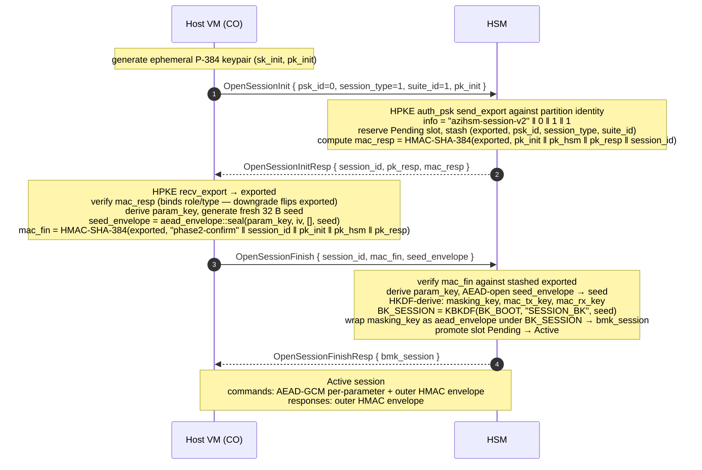
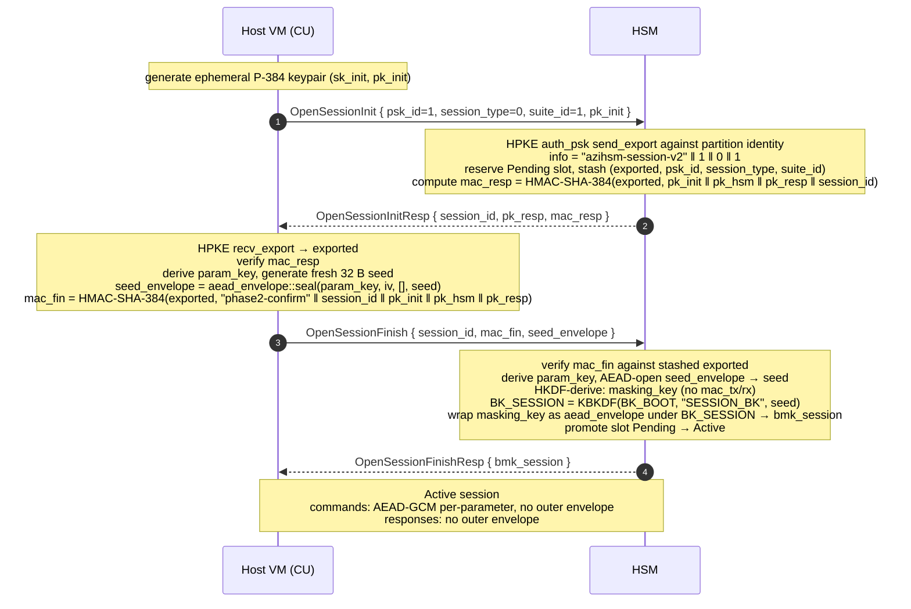

<!--
Copyright (c) Microsoft Corporation.
Licensed under the MIT License.
-->

# TBOR DDI Commands

Per-command specifications for the TBOR DDI protocol.

Per-command documents in [`commands/`](./commands/) describe only the
request and response **bodies** (the TOC entries that follow the
shared headers below).  Wire framing, TOC entry layout, alignment, and
schema features are defined in the
[TBOR encoding specification](../../fw/core/ddi/tbor/docs/spec.md).

Only commands with a landed firmware handler are listed.

## Request header

Every TBOR DDI request begins with a 4-byte header followed by the
request body's TOC entries and optional variable-length data section.

| Offset | Size | Field | Description |
|---|---|---|---|
| 0 | 1 B | `version` | Protocol version.  Current version is `0x01`. |
| 1 | 1 B | `reserved` | Reserved, MUST be `0x00`. |
| 2 | 1 B | `toc_count` | Bits 4-0: number of TOC entries minus 1 (`0` = 1 entry, `0x1F` = 32 entries).  Bits 7-5 reserved, MUST be `0`. |
| 3 | 1 B | `opcode` | Command identifier; see the [command table](#commands) below. |

## Response header

Every TBOR DDI response begins with an 8-byte header.  `status` carries
the `HsmError` value for the request — `0x00000000` on success, a
non-zero `HsmError` variant on failure.  Error responses contain a
single `none` TOC placeholder and no typed body fields.

| Offset | Size | Field | Description |
|---|---|---|---|
| 0 | 1 B | `version` | Protocol version.  MUST match the request's `version`. |
| 1 | 1 B | `flags` | Bit 0: `FIPS_APPROVED` — set if the operation used only FIPS-approved algorithms.  Bits 1-7 reserved, MUST be `0`. |
| 2 | 1 B | `reserved` | Reserved, MUST be `0x00`. |
| 3 | 1 B | `toc_count` | Bits 4-0: number of TOC entries minus 1.  Bits 7-5 reserved, MUST be `0`. |
| 4 | 4 B | `status` | Little-endian `HsmError` value.  `0x00000000` = success. |

## Commands

| Opcode | Command | Session | Doc |
|---|---|---|---|
| `0x01` | `GetApiRev` | NoSession | [`commands/get_api_rev.md`](./commands/get_api_rev.md) |
| `0x10` | `OpenSessionInit` | NoSession | [`commands/open_session_init.md`](./commands/open_session_init.md) |
| `0x11` | `OpenSessionFinish` | NoSession | [`commands/open_session_finish.md`](./commands/open_session_finish.md) |
| `0x12` | `CloseSession` | InSession | [`commands/close_session.md`](./commands/close_session.md) |
| `0x20` | `ChangePsk` | InSession | [`commands/change_psk.md`](./commands/change_psk.md) |
| `0x30` | `PartInit` | InSession | [`commands/part_init.md`](./commands/part_init.md) |

## Default-PSK gate

Partitions ship with publicly-known compiled-in default PSKs
(`AZIHSM-DEFAULT-CO-PSK-v1--------` /
`AZIHSM-DEFAULT-CU-PSK-v1--------`) so they are usable at bring-up.
A session opened against an un-rotated default PSK has no
authentication value and the dispatcher refuses to run any
production work on it.

While the calling session's role still has its **default PSK**, the
only in-session commands permitted are:

| Opcode | Command | Why it's allowed |
|---|---|---|
| `0x12` | `CloseSession` | Tear-down has no security impact |
| `0x20` | `ChangePsk` | The rotation itself |

Any other in-session opcode returns `DefaultPskMustRotate`
(`0x087000E6`).  The gate is **per role**: rotating the CO PSK
unlocks CO sessions but does not affect CU; rotating the CU PSK is a
separate operation.  Out-of-session opcodes (`GetApiRev`,
`OpenSessionInit`, `OpenSessionFinish`) are never gated so a client
can always open the bootstrap session.

**Bootstrap sequence (mandatory on first provisioning):**

1. Open a session for the role under the default PSK.
2. Issue `ChangePsk` as the first in-session command.
3. (Optional) `CloseSession`; subsequent sessions are unrestricted.

The gate is **safe-by-default** in code: future opcodes added to the
dispatcher are gated unless explicitly placed on the
`allowed_with_default_psk` allow-list in
`fw/core/lib/src/ddi/tbor/mod.rs`.

## Session establishment flows

Session establishment is a two-message handshake driven by
[`OpenSessionInit`](./commands/open_session_init.md) and
[`OpenSessionFinish`](./commands/open_session_finish.md).  The flow is
the same shape for both roles, but the negotiated `session_type` pins
which keys the schedule derives and therefore which envelope
subsequent in-session commands carry.

Resume is **not** a TBOR concern.  A host that wants to restore a
prior session's `masking_key` blob across resets uses the MBOR
`ReopenSession` command instead; every `OpenSessionInit` here opens
a fresh session.

### Crypto Officer (Authenticated, `psk_id = 0`, `session_type = 1`)

The CO channel binds every in-session command and response with an
outer per-direction HMAC envelope so that even though parameter
ciphertexts are individually authenticated by AEAD-GCM, command
framing, opcode, and TOC layout are also covered.

### Crypto User (PlainText, `psk_id = 1`, `session_type = 0`)

The CU channel keeps the same HPKE handshake (so role and
`session_type` are still bound by the Phase-1 confirmation MAC and
neither side can be downgraded mid-handshake) but the derived schedule
omits the per-direction HMAC keys.  In-session commands and responses
travel without an outer envelope; parameter confidentiality and
integrity is provided per-parameter by AEAD-GCM alone.

### Teardown

Either party can end an active session: the host issues
[`CloseSession`](./commands/close_session.md) (which the HSM
acknowledges and zeroizes the slot), and the HSM unilaterally
zeroizes any session whose slot it needs to reclaim (`bmk_session`
may still be re-presented later via the resume path on a fresh
`OpenSessionInit`).

